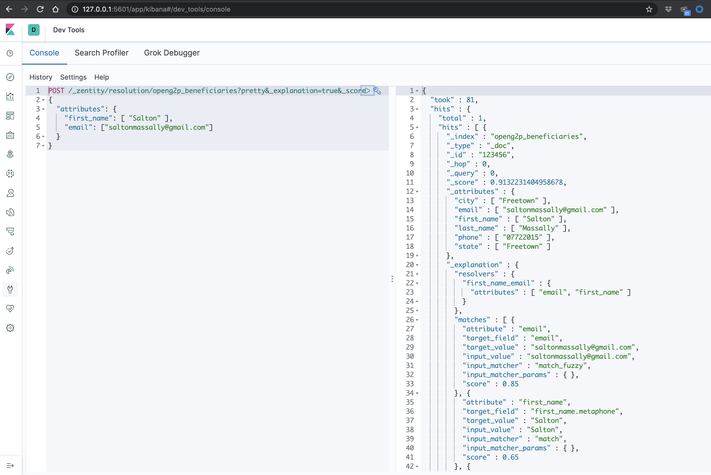

# OpenG2P Search Service

The “OpenG2P” is a set of digital building blocks opensourced to support large scale cash
transfer programs digitize key cogs in their delivery chain: 1) beneficiary targeting
and enrollment, 2) beneficiary list management, 3) payment digitization, and 4)
recourse.

This project provides an extensible entity resolution framework for finding/matching persons usually lacking
unique identities, helping programs main the uniqueness of and deduplicate their beneficiary lists.

Can be used as a standalone component and also integrates with the [OpenG2P CRM](https://github.com/openg2p/crm)

## Background
Government-to-persons programs must be confident of the uniqueness of beneficiaries they serve and avoid double-dipping. A social protection transfer program, as an example, should not be paying the same individual multiple times per period. Yet, this is a significant challenge
in countries where universal unique ID coverage, e.g., national ID, is low. The OpenG2P Search Service helps alleviate this and improve confidence in these disbursement lists by using combinations of beneficiary's attributes (e.g., name, address, dob) to find high probabilities of duplicates. The strategy employed is called entity resolution and also accounts for typos and representation nuisances in these attributes, e.g., names, addresses, etc

By default, it leverages [elasticsearch](https://www.elastic.co) and [zentity](https://zentity.io/) for entity resolution 
but provides an easily extensible framework for adopters to add more methods, e.g. facial recognition. 

## Getting Started

> **_WARNING:_**  
>Do not use it as your data store!
>Do not expose to the internet or untrusted networks in production!

### Using  Docker Compose
You can get started by using the docker-compose which starts both the server and its dependencies.

```shell script
docker-compose up -d
```

### Manually

You will need to have  [elasticsearch 7.6.1](https://www.elastic.co/downloads/past-releases/elasticsearch-7-6-1) up and running
with the following plugins installed:
- [zentity 1.6.0](https://zentity.io/releases/zentity-1.6.0-elasticsearch-7.6.1.zip)
- analysis-phonetic
- analysis-icu

```shell script
elasticsearch-plugin install https://zentity.io/releases/zentity-1.6.0-elasticsearch-7.6.1.zip
elasticsearch-plugin install analysis-phonetic
elasticsearch-plugin install analysis-icu
```

Set `searchservice.elastic.endpoint` to your elasticsearch endpoint e.g. `http://localhost:9200`

```shell script
./gradlew bootRun
```

> **_NOTE:_**  
> Will not start if it cannot connect to elasticsearch!

## User Guide
Provides a Rest API for persons/beneficiaries data to be indexed and queried. A typical use case will
1) index all enrolled beneficiaries into the search service
2) query the search service to assert that beneficiary not already enrolled before proceed
3) use for existing deduplicating enrollments 

### API

#### Indexing Beneficiary
Adding a beneficiary to the search service, e.g., beneficiary add to your program

```shell script
POST /index
{
    "city": "Freetown",
    "email": "saltonmassally@gmail.com",
    "first_name": "Salton",
    "id": "{id}",
    "last_name": "Massally",
    "phone": "07722015",
    "state": "Freetown",
    "street": "5 Foday Drive",
    "street2": "Hill Station"
}
```
`id` must be unique, ideally beneficiary ID in your database. This is what we will be returned if that beneficiary 
matches a query.

#### Searching for Beneficiary
Query for beneficiaries very likely referring to the same person as the query data

```shell script
POST /index/search
{
  "attributes": {
    "first_name": "Salton",
    "last_name": "Massally",
    "phone": ["202-555-1234", "317-555-1234"],
    "email": "saltonmassally@gmail.com"
  }
}
```
```shell script
RESPONSE: HTTP 200 

[
    {
        "beneficiary": "{id}",
        "reasons": [
            "email ->  Input: saltonmassally@gmail.com | Match: saltonmassally@gmail.com | Type: match_fuzzy ",
            "first_name.metaphone ->  Input: Salton | Match: Salton | Type: match ",
            "first_name.nysiis ->  Input: Salton | Match: Salton | Type: match ",
            "first_name.soundex ->  Input: Salton | Match: Salton | Type: match ",
            "first_name ->  Input: Salton | Match: Salton | Type: match_fuzzy ",
            "last_name.metaphone ->  Input: Massally | Match: Massally | Type: match ",
            "last_name.nysiis ->  Input: Massally | Match: Massally | Type: match ",
            "last_name.soundex ->  Input: Massally | Match: Massally | Type: match ",
            "last_name ->  Input: Massally | Match: Massally | Type: match_fuzzy "
        ]
    }
]
```
Returns a list of map of beneficiaries with the id being that used to index the record and a list of reasons why the record
matched the query. Querying with as much data as possible increases the likelihood of finding duplicates if any exists.

#### De-indexing Beneficiary 

Removing a beneficiary from the search service, e.g., beneficiary removed from your program

```shell script
DELETE /index/{id}
```
Where `id` is what was used to index beneficiary

### Allowed fields

Table shows a list of beneficiary attributes allowed for indexing and querying:

| Attribute               | Type   | Note                                                                 |
|-------------------------|--------|----------------------------------------------------------------------|
| id                      | String | Required; beneficiary's unique ID in your database                   |
| identity                | String | Identity records in the form **type-number**. e.g. passport-1234567  |
| first_name              | String |                                                                      |
| middle_name             | String |                                                                      |
| last_name               | String |                                                                      |
| phone                   | String | Please remove the country code e.g. 0778763839 and not +232778763839 |
| email                   | String |                                                                      |
| street                  | String |                                                                      |
| street2                 | String |                                                                      |
| city                    | String | City or town depending on context                                    |
| state                   | String | State or District depending on context                               |
| postal_code             | String |                                                                      |
| dob                     | String | please use form 1990/07/23                                           |
| bank                    | String | Name of bank or any organization that payment is sent to             |
| bank_account            | String | Bank account number                                                  |
| emergency_contact_name  | String | Name of person listed as emergency contact                           |
| emergency_contact_phone | String | Phone of person listed as emergency contact; without country code    |

You do not need to provide all this data when indexing or querying for records; however the more attributes you can 
supply, the better the precision of your result; i.e. try to supply all these fields for both index and query operations!

### Kibana UI

The  docker-compose ships with Kibana, providing the power to visualize your beneficiary data in custom ways and 
run queries against the elasticsearch backend. 

**Navigate to `http://<you-ip-address>:5601`**



We appreciate the contributions of these visualizations.

## How it works
The default implementation works via the process of entity resolution. It compares attributes of the query provided against its database of indexed beneficiaries to find a match very likely referencing the same person.

Below is the set of matching rules employed:

- identity (ID Type Number)
- first_name, last_name, phone
- first_name, phone
- first_name, last_name, phone
- last_name, phone
- first_name, last_name, email
- first_name, phone
- last_name, phone
- first_name, last_name, middle_name, dob
- first_name, last_name, street, street2, city, state
- first_name, last_name, street, city, state
- first_name, last_name, street, state
- first_name, last_name, middle_name, street2, state
- first_name, last_name, street, postal_code
- first_name, last_name, dob, city, state
- first_name, last_name, emergency_contact_phone
- first_name, last_name, middle_name, emergency_contact_name
- first_name, last_name, bank_account_bank, bank_account_number
- first_name, bank_account_bank, bank_account_number
- last_name, bank_account_bank, bank_account_number

> **_NOTE:_**  
> To compensate for typos and near infinite representation of the same information, we employ a selection of fuzzy matching and phonetics algorithms when indexing and querying

## Development

### Dockerizing
Creating a docker image

```shell script
./gradlew clean
./gradlew build
docker build --build-arg JAR_FILE=build/libs/*.jar -t openg2p/searchservice .
```

### Adding A New Search Backend

Adopters can add and replace existing backends. Consider the example of adding a facial recognition backend that,
added to the existing elasticsearch implementation, will compare the facial portrait of a person pending enrollment against beneficiaries already enrolled in a program. Assuming beneficiaries' photos are stored in an attribute called `photo`, 
implementation will lock like:

1) Provide a new implementation of `org.openg2p.searchservice.services.backends.Backend` and annotate with springs' `@Service` annotation
2) Add `photo` to `searchservice.allowed_query_attributes` while redeclaring the defaults in `org.openg2p.searchservice.config.Configurations.allowedQueryAttributes`

Your newly implemented backend will be passed data to index when the index API is called; a good practice is to check
that the `photo` attribute exists before running your logic. That same method is called for both create and update document operations.

To remove an existing backend, simply remove springs `@Service` annotation for that backend's implementation. 

### Roadmap
- [ ] Automated Testing 
- [ ] Queue deduplication tasks 


### Reference Documentation
For further reference, please consider the following sections:


### Additional Links
These additional references should also help you:
